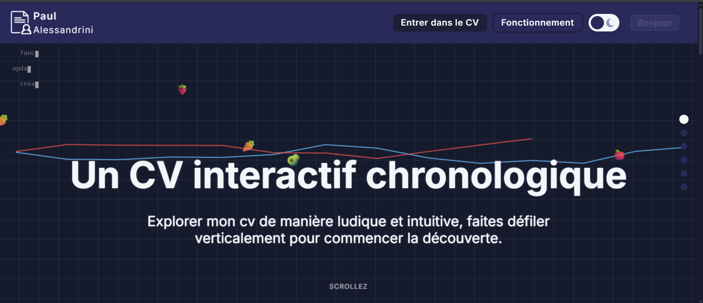

# Interactive CV — a framework-free front-end lab

Interactive, chronological CV built with vanilla JavaScript, HTML and CSS, in production: **https://cv-interactif-paul.vercel.app**



First personal project (2025), used both as a public CV and as a hands-on lab for the web platform. Every feature below is written against the DOM and browser APIs directly; the only build step is an esbuild bundle for the embedded terminal.

**Why no framework:** learn the platform first — DOM, Web APIs, accessibility and performance — before adding an abstraction on top of it. The result is a site whose interactions can be read end to end in the `js/` folder.

## Highlights

| Feature                | What it does                                                                                                                              |
| ---------------------- | ----------------------------------------------------------------------------------------------------------------------------------------- |
| **Timeline slider**    | Range-based chronological navigation with snap points, mobile swipe and a per-period skills panel                                         |
| **Trading chart**      | Interactive candlestick chart (Lightweight Charts v5 API: `addSeries`, `createSeriesMarkers`) with crosshair and event markers            |
| **Search**             | Full-text search over the skills dataset with autocomplete, period/category filters, localStorage history and an accessible modal overlay |
| **Drag & drop**        | HTML5 Drag and Drop with a Pointer Events fallback for touch devices, scroll locking while dragging, live-region feedback                 |
| **Embedded terminal**  | xterm.js console bundled with esbuild — `help`, `dev`, `projet`, `contact`, `pdf`, `goto <section>`                                       |
| **Stats dashboard**    | Skills analytics computed in a Web Worker, plus GitHub language breakdown and two-profile comparison via the GitHub REST API              |
| **Favourites**         | Bookmark skills, dedicated page, JSON export/import, persisted in localStorage                                                            |
| **Light / dark theme** | Full theme switch with adaptive icons, persisted across pages                                                                             |
| **Palette generator**  | Custom colour theme from a seed colour (8 harmony modes via The Color API) with history                                                   |
| **Accessibility**      | Focus trap in modals, ARIA roles and live regions, keyboard navigation (Esc, Tab cycling, Alt+←/→ history), responsive down to mobile     |

## Stack


Vanilla JavaScript (ES modules + IIFE) · HTML5 · CSS3 · esbuild 0.23 · xterm.js 5.3 + fit addon · Lightweight Charts (CDN) · Web Workers · localStorage · Vercel

## Run locally

```bash
npm install
npm run build        # bundles the xterm.js terminal into js/dev/dist/
```

Serve the root folder with any static server (e.g. VS Code Live Server). Asset paths are root-relative (`/js/...`, `/css/...`).

| Command                 | Purpose                                     |
| ----------------------- | ------------------------------------------- |
| `npm run build`         | production bundle of the terminal (esbuild) |
| `npm run watch:console` | rebuild the terminal on change              |

## Structure

```
index.html               # Landing page
html/                    # cv.html · contact-info.html · favoris.html · stats.html
css/style.css            # Global styles, themes, responsive rules
js/
├── main.js              # Timeline slider, snap markers, skills panel, download modal
├── index-landing.js     # Landing page scroll sections
├── analytics/           # Stats dashboard, Web Worker, GitHub API client
├── color-theme/         # Palette generator + history
├── dev/                 # Embedded terminal (xterm.js source + esbuild output)
├── favorites/           # Favourites manager, UI and page
├── leclerc/             # Drag & drop module
├── nav-history/         # In-site navigation history (Alt+←/→)
├── navbar/              # Hamburger menu
├── search/              # Skills dataset, search, autocomplete, filters, history
├── toast/               # Toast notifications
├── trade/               # Candlestick chart
└── utility/             # Theme toggle, live clock, animated background, helpers
```

## Author

Paul Alessandrini — Web developer · [LinkedIn](https://www.linkedin.com/in/paul-alessandrini) · [GitHub](https://github.com/Palalde)
